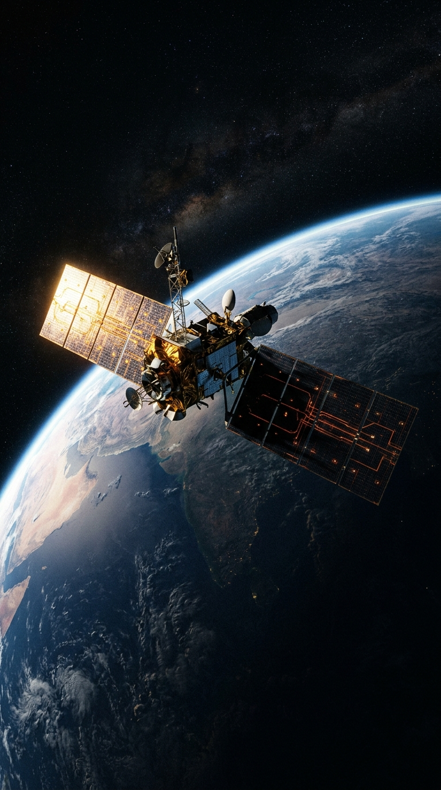
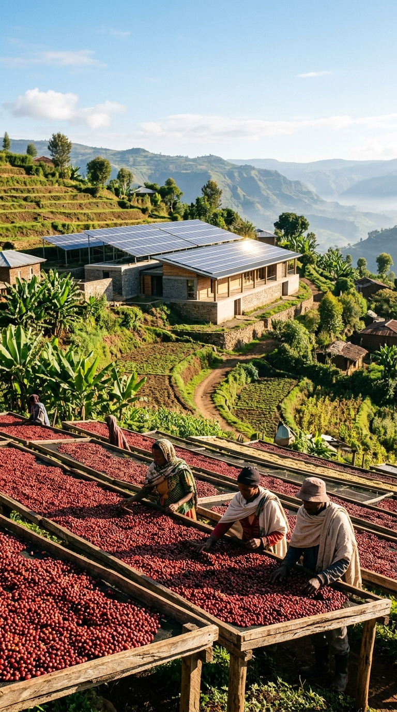
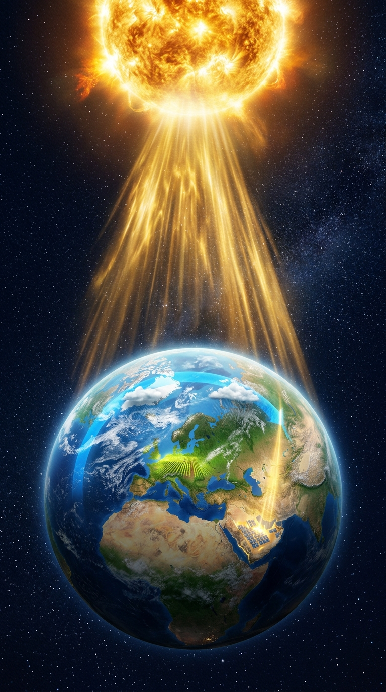
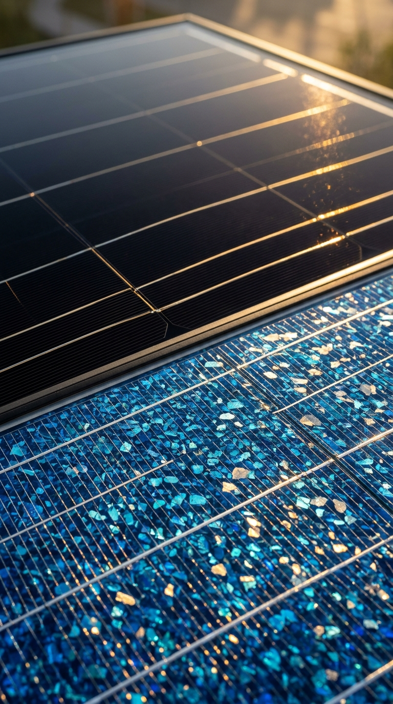
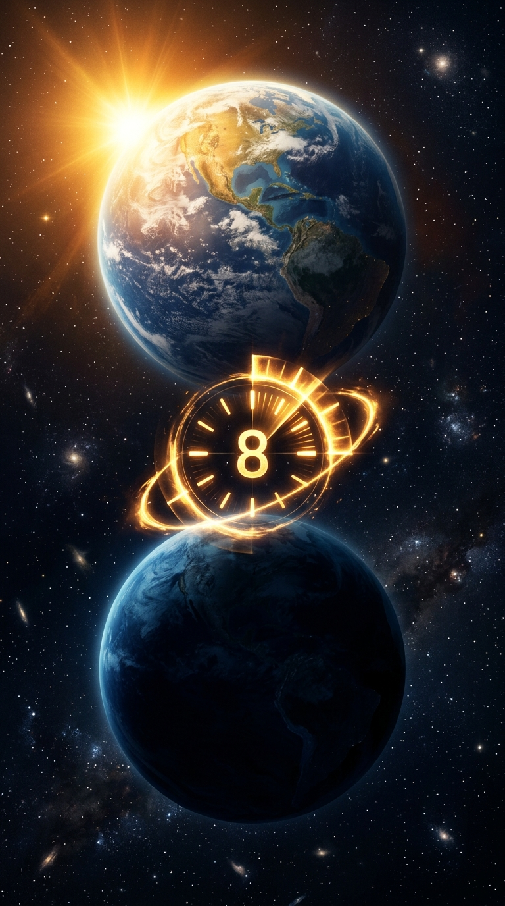

# ☀️ ዩኒቨርሳል ኤሌክትሮኒክስ ኢትዮጵያ — የሶላር ታሪኮች (የአማርኛ ይዘቶች ስብስብ)

> **የቲክቶክ፣ ሪልስ እና ሾርትስ የቪዲዮ ይዘቶችና ስክሪፕቶች ማዘጋጃ ሰነድ**  
> *ለ9:16 ቨርቲካል ቪዲዮ ፎርማት በጥራት የተዘጋጀ*  
> **አድራሻ:** ተፈራ ቢዝነስ ሴንተር፣ ሀብተ ጊዮርጊስ፣ አዲስ አበባ፣ ኢትዮጵያ  
> **ድህረ ገጽ:** [universalelectronicset.com](https://universalelectronicset.com/)

---

## 📋 የይዘት ማውጫ
1. [ታሪክ 01: በብርሃን ውስጥ ኤሌክትሪክን ያገኘው የ19 ዓመቱ ወጣት](#ታሪክ-01-በብርሃን-ውስጥ-ኤሌክትሪክን-ያገኘው-የ19-ዓመቱ-ወጣት)
2. [ታሪክ 02: በህዋ (Space) ውስጥ የኤሌክትሪክ ፖሎች የሉም](#ታሪክ-02-በህዋ-space-ውስጥ-የኤሌክትሪክ-ፖሎች-የሉም)
3. [ታሪክ 03: የፀሐይ ኃይል ከሶላር ፓነሎች በፊትም ነበረ](#ታሪክ-03-የፀሐይ-ኃይል-ከሶላር-ፓነሎች-በፊትም-ነበረ)
4. [ታሪክ 04: ፀሐይ ምን ያህል ኃይለኛ ናት?](#ታሪክ-04-ፀሐይ-ምን-ያህል-ኃይለኛ-ናት)
5. [ታሪክ 05: የሶላር ፓነሎች ለምን ሰማያዊ ወይም ጥቁር ይሆናሉ?](#ታሪክ-05-የሶላር-ፓነሎች-ለምን-ሰማያዊ-ወይም-ጥቁር-ይሆናሉ)
6. [ታሪክ 06: ፀሐይ ድንገት ብትጠፋ ምን ይፈጠራል?](#ታሪክ-06-ፀሐይ-ድንገት-ብትጠፋ-ምን-ይፈጠራል)
7. [ታሪክ 07: ከብሔራዊ የኤሌክትሪክ መስመር ውጭ መኖር ይችላሉ?](#ታሪክ-07-ከብሔራዊ-የኤሌክትሪክ-መስመር-ውጭ-መኖር-ይችላሉ)

---

## ታሪክ 01: በብርሃን ውስጥ ኤሌክትሪክን ያገኘው የ19 ዓመቱ ወጣት

**ምድብ:** ታሪክ  
**ዋና ነጥብ:** 1839 • የላቦራቶሪ ሙከራ • የፎቶቮልታይክ ግኝት (Photovoltaic Effect)  

### 🎣 የቲክቶክ መግቢያ (Opening Hook)
> “በ19 ዓመታችሁ ምን ታደርጉ ነበር? ኤድሞንድ ቤክሬል ብርሃን ኤሌክትሪክ ማመንጨት እንደሚችል ሲያገኝ ነበር!”

### 📖 ሙሉ ማብራሪያና ታሪክ
በ1839 በፓሪስ የሚገኝ አንድ የድሮ የሳይንስ ላቦራቶሪ ያስቡ። በዚያ ዘመን ምንም ዓይነት የሶላር ፓነሎች፣ የሊቲየም ባትሪዎች ወይም ግዙፍ የኤሌክትሪክ ጣቢያዎች አልነበሩም። ኤሌክትሪክ ራሱ ገና አዲስና አጃኢብ የሚባል የሳይንስ መስክ ነበር። በዚያ አስደናቂ ሁኔታ ውስጥ፣ የ19 ዓመቱ አሌክሳንደር ኤድሞንድ ቤክሬል የታዋቂው ፊዚሲስት አባቱ ላቦራቶሪ ውስጥ ምርምር ያደርግ ነበር።

ኤድሞንድ የብረት ኤሌክትሮዶችን በፈሳሽ ውስጥ አድርጎ የፀሐይ ብርሃን በሙከራው ላይ ሲያርፍበት፣ የኤሌክትሪክ ፍሰቱ በከፍተኛ ሁኔታ እንደተቀየረና ኃይል እንደተፈጠረ አስተዋለ። ይህ ታሪካዊ ግኝት **Photovoltaic Effect (የፎቶቮልታይክ ክስተት)** በመባል ታወቀ—ይህም ብርሃን ቁሳቁሶችን በመንካት ኤሌክትሪክ እንዲያመነጩ የማድረግ ተፈጥሯዊ ህግ ነው።

የቤክሬል ሙከራ ያኔ ወዲያውኑ የቤት ላይ ሶላር ፓነል አልፈጠረም። የሚመነጨው ኤሌክትሪክ በጣም ትንሽ ነበር። ነገር ግን አስተሳሰቡ አብዮታዊ ነበር፡ የፀሐይ ብርሃን የሙቀትና የብርሃን ምንጭ ብቻ ሳይሆን በቀጥታ ወደ ኤሌክትሪክ ኃይል የሚቀየር ታላቅ የተፈጥሮ ጸጋ መሆኑ ተረጋገጠ።

ዛሬ በቤታችን፣ በንግድ ተቋማት፣ በቴሌኮም ማማዎችና በህዋ ሳተላይቶች ላይ የምንጠቀማቸው የሶላር ፓነሎች በሙሉ የሚሰሩት በዚያው በ19 ዓመቱ ወጣት ግኝት መርህ ላይ ተመስርተው ነው!

### 📱 90-ሰከንድ የአማርኛ ቲክቶክ ስክሪፕት (Teleprompter)

- ⏱️ **0–04 ሰከንድ**  
  🎬 **የቪዲዮ እይታ:** የድሮ ላቦራቶሪ። ጽሑፍ: "ፓሪስ፣ 1839"  
  🎙️ **የድምፅ ንግግር:** *“በ19 ዓመታችሁ ምን ታደርጉ ነበር?”*

- ⏱️ **04–12 ሰከንድ**  
  🎬 **የቪዲዮ እይታ:** ወጣቱ ሳይንቲስት በፈሳሽ ውስጥ ኤሌክትሮዶችን ያዘጋጃል።  
  🎙️ **የድምፅ ንግግር:** *“ኤድሞንድ ቤክሬል በአባቱ ላቦራቶሪ ውስጥ በብርሃንና በኤሌክትሪክ ይሞክር ነበር።”*

- ⏱️ **12–22 ሰከንድ**  
  🎬 **የቪዲዮ እይታ:** የፀሐይ ጨረር በሙከራው ላይ ሲያርፍ የቆጣሪው መርፌ ይንቀሳቀሳል።  
  🎙️ **የድምፅ ንግግር:** *“ብርሃኑ ሙከራውን ሲነካው የኤሌክትሪክ እንቅስቃሴው ተቀየረ።”*

- ⏱️ **22–32 ሰከንድ**  
  🎬 **የቪዲዮ እይታ:** ፎቶኖች ሲያርፉ ኤሌክትሪክ ሲፈስ የሚያሳይ አኒሜሽን።  
  🎙️ **የድምፅ ንግግር:** *“ብርሃን ኤሌክትሪክ ማመንጨት እንደሚችል የመጀመሪያውን ማረጋገጫ አየ።”*

- ⏱️ **32–46 ሰከንድ**  
  🎬 **የቪዲዮ እይታ:** ከ1839 ሙከራ ወደ ዘመናዊ የሶላር ሴሎች ሽግግር።  
  🎙️ **የድምፅ ንግግር:** *“ያኔ ወዲያውኑ የሶላር ፓነል አልተሰራም፣ ነገር ግን ትልቅ በር ከፈተ።”*

- ⏱️ **46–61 ሰከንድ**  
  🎬 **የቪዲዮ እይታ:** የቤት ላይ ሶላር ፓነሎች እና ሳተላይቶች።  
  🎙️ **የድምፅ ንግግር:** *“ያች ትንሽ ላቦራቶሪ ዛሬ በምድርና በህዋ ላይ ለምንጠቀመው ቴክኖሎጂ መነሻ ሆነች።”*

- ⏱️ **61–74 ሰከንድ**  
  🎬 **የቪዲዮ እይታ:** ወጣቱ ሳይንቲስት ማስታወሻ ሲጽፍ።  
  🎙️ **የድምፅ ንግግር:** *“የሶላር አብዮት የጀመረው በትልቅ ፋብሪካ ሳይሆን በጉጉትና በመጠየቅ ነበር።”*

- ⏱️ **74–85 ሰከንድ**  
  🎬 **የቪዲዮ እይታ:** የዩኒቨርሳል ኤሌክትሮኒክስ መዝጊያ።  
  🎙️ **የድምፅ ንግግር:** *“አንድ ጥያቄ መጪውን ጊዜ ሊቀይር ይችላል። ዛሬስ ወጣቶች ምን አዲስ ነገር ይፈጥራሉ?”*

### 💬 የአማርኛ መግለጫ እና ሃሽታጎች (Caption)
በ19 ዓመቱ ኤድሞንድ ቤክሬል ብርሃን ኤሌክትሪክ ማመንጨት እንደሚችል አገኘ! የ1839 ሙከራው ለዛሬው የሶላር ፓነል መሰረት ሆነ። ታላላቅ ቴክኖሎጂዎች ብዙውን ጊዜ የሚጀምሩት ከአንድ ትንሽ ምልከታ ነው። መጪው ትውልድ ምን አዲስ ነገር የሚፈጥር ይመስላችኋል?

`#ዩኒቨርሳልኤሌክትሮኒክስ` `#የሶላርታሪክ` `#ኢትዮጵያ` `#ሳይንስ` `#የሶላርኃይል` `#አዲስአበባ` `#DidYouKnow`

---

## ታሪክ 02: በህዋ (Space) ውስጥ የኤሌክትሪክ ፖሎች የሉም

**ምድብ:** ህዋ  
**ዋና ነጥብ:** የሶላር ፓነሎች • ሊቲየም ባትሪዎች • በጨለማ ወቅት ኃይል መስጠት  

### 🎣 የቲክቶክ መግቢያ (Opening Hook)
> “በህዋ ውስጥ የኤሌክትሪክ ፖሎች የሉም—ታዲያ ሳተላይቶች እንዴት ኃይል ያገኛሉ?”

### 📖 ሙሉ ማብራሪያና ታሪክ
ሳተላይት ከምድር ሲታይ በህዋ ውስጥ ጸጥ ብሎ የሚንሳፈፍ ይመስላል፤ ነገር ግን በውስጡ ሳያቋርጥ ይሰራል! የአየር ሁኔታ መረጃዎችን ይሰበስባል፣ የቴሌቪዥንና ስልክ ምልክቶችን ያስተላልፋል፣ የጂፒኤስ መሪዎችን ይመራል፣ እንዲሁም ሳይንሳዊ ምርምሮችን ያከናውናል። እያንዳንዱ ተግባር አስተማማኝ ኤሌክትሪክ ይፈልጋል።

በምድር ዙሪያ ለሚሰሩ አብዛኞቹ ሳተላይቶች መፍትሄው የፀሐይ ኃይል ነው። በሳተላይቱ ክንፎች ላይ የተገጠሙት የሶላር ሴሎች የፀሐይ ብርሃንን ወደ ኤሌክትሪክ በመቀየር የሳተላይቱን መሳሪያዎች ያሰራሉ፤ እንዲሁም ውስጣዊ የሊቲየም ባትሪዎችን ይሞላሉ።

ባትሪዎቹ በጣም ወሳኝ ናቸው ምክንያቱም ሳተላይቱ በምድር ዙሪያ ሲሽከረከር በምድር ጥላ ስር (Night side) ያልፋል። በዚያ ጨለማ ወቅት የሶላር ፓነሎቹ ብርሃን አያገኙም፤ ታዲያ በባትሪ የተቀመጠው ኃይል ሳተላይቱ ሳይጠፋ ስራውን እንዲቀጥል ያደርጋል!

### 📱 90-ሰከንድ የአማርኛ ቲክቶክ ስክሪፕት (Teleprompter)

- ⏱️ **0–04 ሰከንድ**  
  🎬 **የቪዲዮ እይታ:** ሳተላይት በህዋ ላይ ይንሳፈፋል።  
  🎙️ **የድምፅ ንግግር:** *“በህዋ ውስጥ የኤሌክትሪክ ፖሎች የሉም።”*

- ⏱️ **04–10 ሰከንድ**  
  🎬 **የቪዲዮ እይታ:** ወደ ሶላር ፓነሎች ማቀረብ።  
  🎙️ **የድምፅ ንግግር:** *“ታዲያ ሳተላይቶች ካሜራዎቻቸውንና ኮምፒውተሮቻቸውን እንዴት ያስኬዳሉ?”*

- ⏱️ **10–21 ሰከንድ**  
  🎬 **የቪዲዮ እይታ:** ፓነሎች ወደ ፀሐይ ዞረው ሲበሩ።  
  🎙️ **የድምፅ ንግግር:** *“የሶላር ሴሎች የፀሐይ ብርሃንን ወደ ኤሌክትሪክ ይቀይራሉ።”*

- ⏱️ **21–33 ሰከንድ**  
  🎬 **የቪዲዮ እይታ:** ኃይል ወደ ባትሪ ሲፈስ።  
  🎙️ **የድምፅ ንግግር:** *“ከፊሉ ኤሌክትሪክ ሳተላይቱን ሲያሰራ፣ ከፊሉ ባትሪ ይሞላል።”*

- ⏱️ **33–45 ሰከንድ**  
  🎬 **የቪዲዮ እይታ:** ሳተላይት ወደ ምድር ጥላ ሲገባ።  
  🎙️ **የድምፅ ንግግር:** *“ሳተላይቱ ወደ ጨለማ ሲገባ በባትሪ የተቀመጠው ኃይል ስራውን ይቀጥላል።”*

### 💬 የአማርኛ መግለጫ እና ሃሽታጎች (Caption)
በህዋ ውስጥ የኤሌክትሪክ ፖል የለም! ሳተላይቶች በሶላር ፓነሎችና ባትሪዎች ኃይል በማመንጨትና በማስቀመጥ ለዓመታት ይሰራሉ። የሶላር ቴክኖሎጂ በህዋ ላይ ከተቻለ በምድር ላይ የተሻለ ህይወት ይፈጥራል!

`#ዩኒቨርሳልኤሌክትሮኒክስ` `#የሶላርታሪክ` `#ህዋ` `#ቴክኖሎጂ` `#ኢትዮጵያ`

---

## ታሪክ 03: የፀሐይ ኃይል ከሶላር ፓነሎች በፊትም ነበረ

**ምድብ:** የሰው ልጅ ፈጠራ  
**ዋና ነጥብ:** የባህላዊ የፀሐይ አጠቃቀም • ቡና ማድረቅ • ተፈጥሯዊ አየር  

### 🎣 የቲክቶክ መግቢያ (Opening Hook)
> “የፀሐይ ኃይል አዲስ ፈጠራ አይደለም። የሶላር ፓነሎች ዘመናዊ መሣሪያዎች ናቸው!”

### 📖 ሙሉ ማብራሪያና ታሪክ
ሰዎች “የሶላር ኃይል” ሲባል ብዙውን ጊዜ ጣሪያ ላይ የሚቀመጠውን ጥቁር የሶላር ፓነል ያስባሉ። ነገር ግን የሰው ልጅ ኤሌክትሪክ ከመፈጠሩ በሺዎች ከሚቆጠሩ ዓመታት በፊት የፀሐይን ኃይል ይጠቀም ነበር!

ጥንታውያን ህንጻዎች የፀሐይን ብርሃንና ሙቀት በጥበብ እንዲቀበሉ ተደርገው ይሰሩ ነበር። አባቶች እህል፣ ፍራፍሬ፣ ስጋና ልብሶችን በፀሐይ ያደርቁ ነበር። በሃገራችን ኢትዮጵያም ቡና፣ እህልና ቅመማ ቅመሞች በፀሐይ ብርሃንና በአየር እንቅስቃሴ ይደርቃሉ። አልጋ መሰል የቡና ማድረቂያዎች የሶላር ፓነል ባይሆኑም፣ የፀሐይን ኃይል በጥበብ የመጠቀም ተፈጥሯዊ ስልቶች ናቸው።

### 📱 90-ሰከንድ የአማርኛ ቲክቶክ ስክሪፕት (Teleprompter)

- ⏱️ **0–05 ሰከንድ**  
  🎬 **የቪዲዮ እይታ:** ዘመናዊ የሶላር ፓነል ይታያል።  
  🎙️ **የድምፅ ንግግር:** *“የሶላር ኃይል የጀመረው በዚህ ይመስላችሁ ይሆናል።”*

- ⏱️ **05–13 ሰከንድ**  
  🎬 **የቪዲዮ እይታ:** ወደ ጥንታዊ መንደር ይሸጋገራል።  
  🎙️ **የድምፅ ንግግር:** *“ነገር ግን የሰው ልጅ የሶላር ሴል ከመፈጠሩ በፊትም የፀሐይ ኃይልን ይጠቀም ነበር።”*

- ⏱️ **39–53 ሰከንድ**  
  🎬 **የቪዲዮ እይታ:** የኢትዮጵያ ቡና ሲደርቅ።  
  🎙️ **የድምፅ ንግግር:** *“በኢትዮጵያም በቡናና በእህል ማድረቅ ላይ ይህን ባህል እናየዋለን።”*

### 💬 የአማርኛ መግለጫ እና ሃሽታጎች (Caption)
የፀሐይ ኃይል በሶላር ፓነል አልጀመረም። ሰዎች ከጥንት ጀምሮ ለብርሃን፣ ለማሞቅና ቡና ለማድረቅ ይጠቀሙበት ነበር። ዘመናዊ ቴክኖሎጂ ብርሃኑን ወደ ኤሌክትሪክ የመቀየር አቅም አከለበት።

`#ዩኒቨርሳልኤሌክትሮኒክስ` `#የሶላርታሪክ` `#የኢትዮጵያቡና` `#ተፈጥሮ` `#ኢትዮጵያ`

---

## ታሪክ 04: ፀሐይ ምን ያህል ኃይለኛ ናት?

**ምድብ:** የፀሐይ ጉልበት  
**ዋና ነጥብ:** 173,000 Terawatts • የውሃ ኡደት • ንጹህ የሶላር ኤሌክትሪክ  

### 🎣 የቲክቶክ መግቢያ (Opening Hook)
> “ፀሐይ ለምድር የምትሰጠው ኃይል የሰው ልጅ መጠቀም ከሚችለው በላይ ነው!”

### 📖 ሙሉ ማብራሪያና ታሪክ
የናሳ (NASA EarthData) ሳይንሳዊ መረጃ እንደሚያሳየው ምድር ከፀሐይ የምታገኘው የኃይል መጠን የሰው ልጅ በሙሉ በዓመት ከሚጠቀመው ኤሌክትሪክና አጠቃላይ ኃይል ከ10,000 እጥፍ በላይ ይበልጣል!

በእርግጥ ያንን ኃይል በሙሉ መሰብሰብ አንችልም ምክንያቱም ምድር ድቡልቡል ናት፣ አየርና ደመናዎች የተወሰነውን ያንጸባርቃሉ፣ እንዲሁም ግማሹ ምድር ሁልጊዜ በሌሊት ጨለማ ውስጥ ነው። ነገር ግን የሶላር ፓነል የፀሐይን ብርሃን በሙሉ መሰብሰብ አይጠበቅበትም፤ በእሱ ላይ የሚያርፈውን ትንሽ ክፍል ወደ ኤሌክትሪክ መለወጥ ብቻ በቂ ነው!

### 📱 90-ሰከንድ የአማርኛ ቲክቶክ ስክሪፕት (Teleprompter)

- ⏱️ **0–05 ሰከንድ**  
  🎬 **የቪዲዮ እይታ:** ትንሽ ምድር ከፀሐይ አጠገብ።  
  🎙️ **የድምፅ ንግግር:** *“ፀሐይ ምን ያህል ኃይለኛ ናት?”*

- ⏱️ **25–39 ሰከንድ**  
  🎬 **የቪዲዮ እይታ:** 10,000× የሚል ትልቅ ቁጥር።  
  🎙️ **የድምፅ ንግግር:** *“ናሳ ምድር ከፀሐይ የምታገኘው ኃይል ከምንጠቀመው ከ10,000 እጥፍ ይበልጣል ይላል።”*

### 💬 የአማርኛ መግለጫ እና ሃሽታጎች (Caption)
ምድር ከፀሐይ የምታገኘው ኃይል የሰው ልጅ ከሚጠቀመው ከ10,000 እጥፍ ይበልጣል። የሶላር ቴክኖሎጂ ተፈጥሮ የሰጠችንን ታላቅ ኃይል በጥበብ የመጠቀም መንገድ ነው!

`#ዩኒቨርሳልኤሌክትሮኒክስ` `#ፀሐይ` `#ኢትዮጵያ` `#ሳይንስ`

---

## ታሪክ 05: የሶላር ፓነሎች ለምን ሰማያዊ ወይም ጥቁር ይሆናሉ?

**ምድብ:** የዕለት ተዕለት ሳይንስ  
**ዋና ነጥብ:** ፖሊክሪስታላይን ሰማያዊ • ሞኖክሪስታላይን ጥቁር • የነጸብራቅ ሽፋን  

### 🎣 የቲክቶክ መግቢያ (Opening Hook)
> “የሶላር ፓነሎች ለምን ነጭ ወይም ቀይ ሳይሆኑ ሰማያዊና ጥቁር ይሆናሉ?”

### 📖 ሙሉ ማብራሪያና ታሪክ
የሶላር ሴል የሚመጣውን ብርሃን በሙሉ መምጠጥ አለበት፤ ብርሃን ተመልሶ ከተንፀባረቀ ኤሌክትሪክ ማመንጨት አይችልም። ሲሊኮን በተፈጥሮው ብርሃን የሚያንፀባርቅ በመሆኑ፣ አምራቾች የብርሃን ነጸብራቅ መከላከያ (Anti-reflective coating) እና ልዩ ወለል ይጠቀማሉ—ይህም ፓነሎቹ ጥቁር ሰማያዊ ወይም ጥቁር እንዲመስሉ ያደርጋቸዋል።

ብዙ ክሪስታሎች ያሏቸው (Multicrystalline) ሰማያዊ መልክ አላቸው፤ አንድ ወጥ ክሪስታል ያላቸው (Monocrystalline) ደግሞ ጥቁር መልክ አላቸው። ነገር ግን ቀለም ብቻውን የፓነል ጥራት መለኪያ አይደለም!

### 📱 90-ሰከንድ የአማርኛ ቲክቶክ ስክሪፕት (Teleprompter)

- ⏱️ **0–05 ሰከንድ**  
  🎬 **የቪዲዮ እይታ:** ሰማያዊና ጥቁር ፓነሎች ጎን ለጎን።  
  🎙️ **የድምፅ ንግግር:** *“የትኛው ይበልጣል፡ ሰማያዊ ወይስ ጥቁር?”*

- ⏱️ **40–53 ሰከንድ**  
  🎬 **የቪዲዮ እይታ:** ቀለም = ጥራት የሚለው ላይ ቀይ X ምልክት።  
  🎙️ **የድምፅ ንግግር:** *“ነገር ግን ቀለም ብቻውን የፓነሉን ጥራት አይናገርም። በትክክለኛ ምህንድስና ይምረጡ!”*

### 💬 የአማርኛ መግለጫ እና ሃሽታጎች (Caption)
ሰማያዊና ጥቁር የሶላር ፓነሎች ብርሃን መምጠጥ እንዲችሉ የተሰሩ ናቸው። ቀለም ብቻውን የጥራት ማረጋገጫ ስላልሆነ በትክክለኛ ዝርዝርና ገጠማ ይምረጡ!

`#ዩኒቨርሳልኤሌክትሮኒክስ` `#የሶላርፓነል` `#ኢትዮጵያ` `#ቴክኖሎጂ`

---

## ታሪክ 06: ፀሐይ ድንገት ብትጠፋ ምን ይፈጠራል?

**ምድብ:** አሳቢ ጥያቄ  
**ዋና ነጥብ:** ለ8 ደቂቃ ያህል • ጨለማ • ምድር ከመዞር ወጥታ በቀጥታ መጓዝ  

### 🎣 የቲክቶክ መግቢያ (Opening Hook)
> “ፀሐይ አሁን ድንገት ብትጠፋ ለ8 ደቂቃ ያህል ምንም አታውቁም!”

### 📖 ሙሉ ማብራሪያና ታሪክ
ይህ በሳይንስ ሊከሰት የሚችል ነገር ባይሆንም ትልቅ የሳይንስ ጥያቄ ነው። የፀሐይ ብርሃን ወደ ምድር ለመድረስ 8 ደቂቃ ያህል ይወስዳል። የስበት ኃይል ለውጥም በብርሃን ፍጥነት ነው የሚጓዘው።

ስለሆነም ፀሐይ ድንገት በቅጽበት ብትጠፋ፣ ምድር ለ8 ደቂቃ ያህል ብርሃን ማግኘቷንና በሕዋ ላይ መዞሯን ትቀጥላለች። ከ8 ደቂቃ በኋላ ግን ሰማዩ ይጨልማል፣ ምድርም ከመዞር ወጥታ በቀጥታ መስመር ትጓዛለች። የሶላር ፓነሎች ማመንጨት ያቆማሉ። ፀሐይ የብርሃን ምንጭ ብቻ ሳትሆን የምድራችን ህይወትና የስበት ምሰሶ ናት!

### 📱 90-ሰከንድ የአማርኛ ቲክቶክ ስክሪፕት (Teleprompter)

- ⏱️ **0–04 ሰከንድ**  
  🎬 **የቪዲዮ እይታ:** መደበኛ ጠዋት። ፀሐይ ትጠፋለች።  
  🎙️ **የድምፅ ንግግር:** *“ፀሐይ አሁን ድንገት ብትጠፋ ለ8 ደቂቃ ያህል ምንም አታውቁም።”*

- ⏱️ **04–14 ሰከንድ**  
  🎬 **የቪዲዮ እይታ:** ሰዓት ወደ 8 ደቂቃ መቁጠር ይጀምራል።  
  🎙️ **የድምፅ ንግግር:** *“ወደ ምድር በመጓዝ ላይ ያለው ብርሃን ለ8 ደቂቃ መድረሱን ይቀጥላል።”*

- ⏱️ **24–36 ሰከንድ**  
  🎬 **የቪዲዮ እይታ:** በ8ኛው ደቂቃ አለም ጨለማ ትሆናለች።  
  🎙️ **የድምፅ ንግግር:** *“ከዚያ የመጨረሻው ብርሃን ያልፋል፣ ሰማዩም ይጨልማል።”*

### 💬 የአማርኛ መግለጫ እና ሃሽታጎች (Caption)
ፀሐይ በድንገት ብትጠፋ ምድር ለ8 ደቂቃ ያህል የነበረውን ብርሃን ታገኛለች። ከዚያ በኋላ ጨለማ ይሆናል። ይህ አሳቢ ጥያቄ ህይወታችን ምን ያህል በፀሐይ ላይ የተመሰረተ መሆኑን ያሳያል!

`#ዩኒቨርሳልኤሌክትሮኒክስ` `#ፀሐይ` `#ሳይንስ` `#ኢትዮጵያ`

---

## ታሪክ 07: ከብሔራዊ የኤሌክትሪክ መስመር ውጭ መኖር ይችላሉ?

**ምድብ:** Off-Grid ፈተና  
**ዋና ነጥብ:** የኃይል ፍላጎት ማወቅ • ባትሪ መደገፍ • የፀሐይ መጠን ማዘጋጀት  

### 🎣 የቲክቶክ መግቢያ (Opening Hook)
> “ዛሬ ከቆጣሪ ተላቀው በሶላር ብቻ መኖር ይችላሉ?”

### 📖 ሙሉ ማብራሪያና ታሪክ
ከብሔራዊ መብራት ውጭ መኖር ቀላል ይመስላል፡ ፓነልና ባትሪ ገዝቶ ከመብራት መቆራረጥ እፎይ ማለት! ነገር ግን አስተማማኝ የሶላር ሲስተም የሚጀመረው በጥያቄዎች እንጂ እቃ በመግዛት አይደለም።

ዋና ዋና እቃዎችን (መብራት፣ ዋይፋይ፣ ፍሪጅ) ከከበሩ እቃዎች (የኤሌክትሪክ ምድጃ፣ ቦይለር) ለይቶ ማወቅ፣ የባትሪ መጠንና የፓነል አቅምን በትክክል ማስላት ይጠይቃል። በጥራት የተሰራ የሶላር ሲስተም ሙሉ የኃይል ነፃነትን ይሰጣል!

### 📱 90-ሰከንድ የአማርኛ ቲክቶክ ስክሪፕት (Teleprompter)

- ⏱️ **0–05 ሰከንድ**  
  🎬 **የቪዲዮ እይታ:** እጅ የመብራት ቆጣሪ ሲያጠፋ።  
  🎙️ **የድምፅ ንግግር:** *“ዛሬ ከቆጣሪ ተላቀው በሶላር ብቻ መኖር ይችላሉ?”*

- ⏱️ **05–15 ሰከንድ**  
  🎬 **የቪዲዮ እይታ:** ቤቱ በሶላር ሲበራ።  
  🎙️ **የድምፅ ንግግር:** *“ይቻላል—ነገር ግን ዝም ብሎ ባትሪ ከመግዛት ይበልጣል። ፍላጎትዎን በጥራት ያሰሉ!”*

### 💬 የአማርኛ መግለጫ እና ሃሽታጎች (Caption)
ከብሔራዊ መብራት ውጭ መኖር ይቻላል? ትክክለኛ የሶላር ሲስተም የሚጀመረው የቤት እቃዎችን የኃይል ፍላጎት በጥራት በማወቅ ነው።

`#ዩኒቨርሳልኤሌክትሮኒክስ` `#OffGridLiving` `#ኢትዮጵያ` `#አዲስአበባ`

---
*ለዩኒቨርሳል ኤሌክትሮኒክስ ኢትዮጵያ የተዘጋጀ — ተፈራ ቢዝነስ ሴንተር፣ ሀብተ ጊዮርጊስ፣ አዲስ አበባ።*
